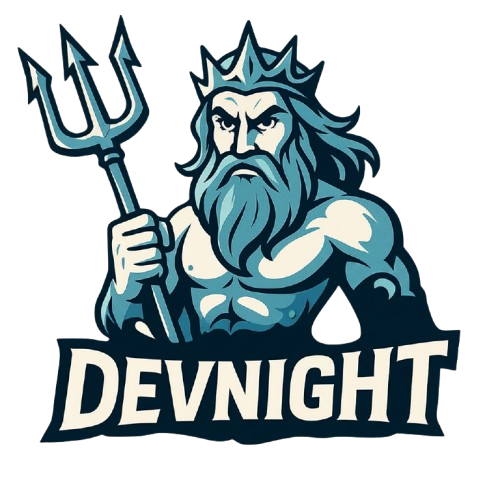
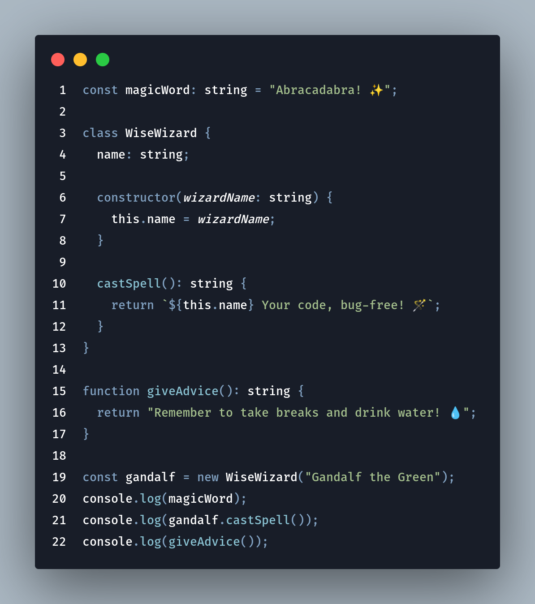

<!-- Centered logo -->

  

<!-- Clickable preview linking to Marketplace -->

  

A minimalist and straightforward theme, inspired by the clean and focused aesthetic of **DeepSeek**.
Designed to provide a comfortable coding experience with good readability.

---

## Installation

1. Open **Visual Studio Code**.
2. Go to `Extensions` (the blocks icon on the left sidebar).
3. Search for `DevNight` (or the exact name you gave your theme).
4. Click `Install`.
5. After installation, go to `Preferences` > `Color Theme` and select `DevNight`.

---

## Contributions

Suggestions and bug reports are very welcome! Feel free to open an [Issue](https://github.com/IvoL1/devnight-theme) in this repository.

---

**Notes:**
* Replace GitHub username and repo name in the issue links.
* Make sure images are in the `images` folder.
* Replace publisher and extension name in the Marketplace link.

---
